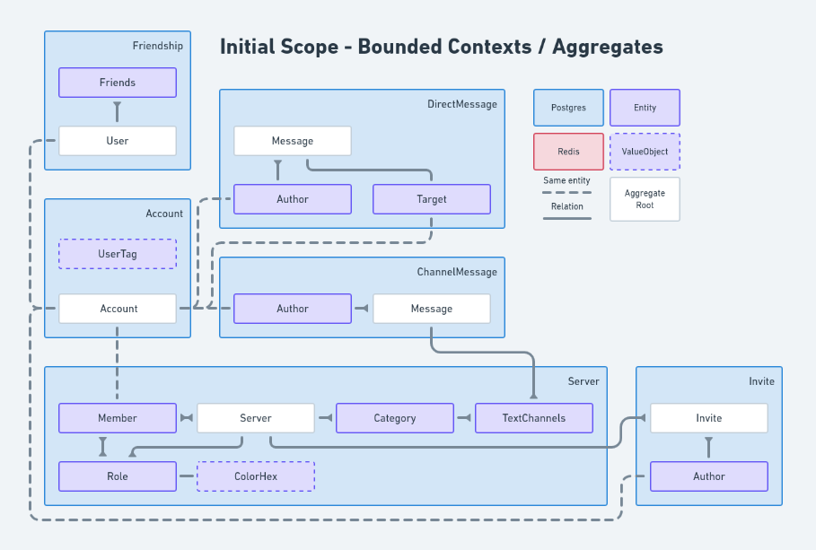
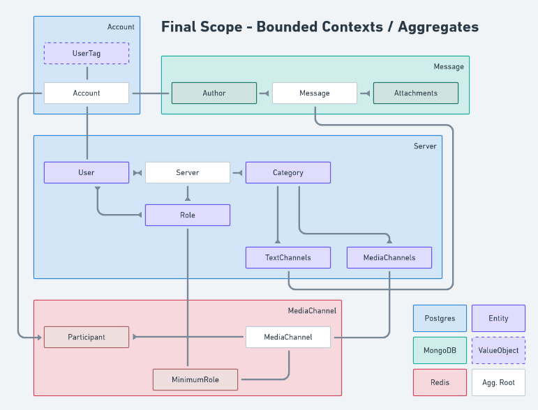

   

<h1 align="center">
  
  
  
</h1>

> #### Agree is a voice, video and text communication service based on Discord, currently under development

 
<h2 align="center">
:construction: ----- Better docs soon ----- :construction:
</h2>
 

<h3 align="center">
Project scope
</h3>

   

   

