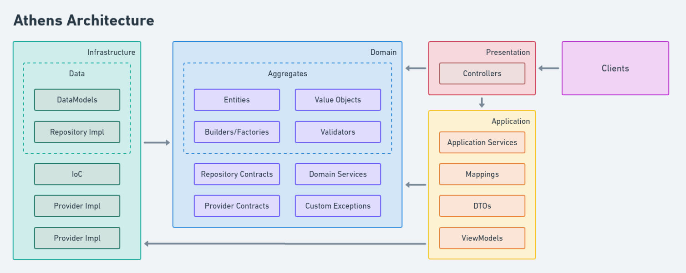

# Athens :balance_scale:

Athens is the main WebApi for Agree. It handles auth, account/server management and messages (for now).

The name "Athens" is a direct reference to the capital of Greece because of all that is represents to the philosophy history and mainly to the philosophical debates. It was the center of learning and debating, as it is now for this project.

<h3 align="center">
    Athens Architecture
</h3>

   

